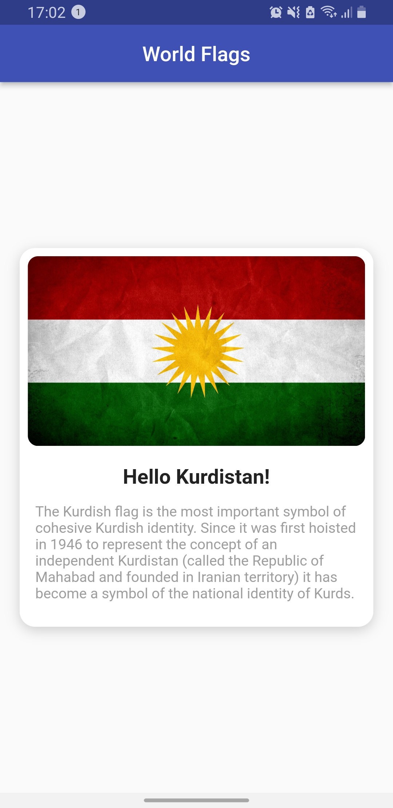

# hello_kurdistan

A new Flutter project.

## Getting Started

Rwanga Foundation WeCode bootcamp starter project.

Current Progress:

For help getting started with Flutter development, view the
[online documentation](https://docs.flutter.dev/), which offers tutorials,
samples, guidance on mobile development, and a full API reference.
